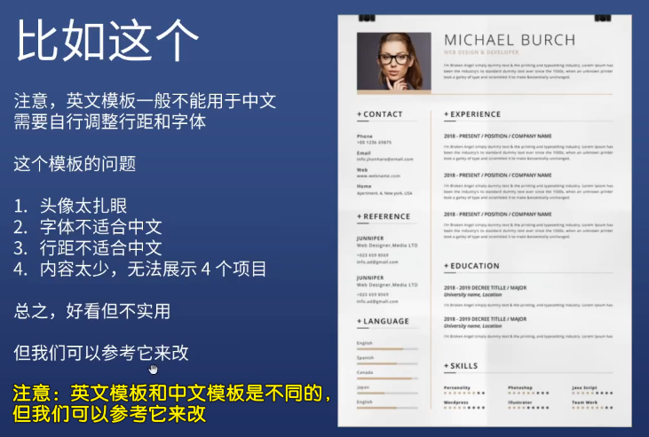

### ✍️ Tangxt ⏳ 2020-11-05 🏷️ resume

# 01-打造自己的专属简历

> 把简历框架搭建好，之后做一个项目就填充一个项目！

## ★本课内容

- 如何找简历模板
- 如何动手制作简历
  - 写内容（HTML）
  - 加功能（JS/echarts）
  - 加样式（CSS）
- 如何生成网页和 PDF
  - 响应式页面
  - print 样式
- 如果你赶时间
  - 直接抄芳芳写好的简历 -> 改成是自己的内容

## ★工具介绍

1）简历模板

> 原则：不要自己设计简历

为什么不要自己设计简历？ -> 因为我们是前端工程师啊，我们只管把页面做出来，不管如何设计页面，毕竟大部分前端的审美都是比较一般的或者亮瞎他人的眼睛

模板选定好后，就开始制作了！ -> 简历模板图片 -> 网页化！

💡：去哪找简历模板？

- Google：「cv template」/「resume template」（可以搜到质量极高的，不过这简历内容是英文的，如果你换成是中文的，那么这简历的整体效果就没那么好看了！）
- 超级简历（内容指导不错，免费用户 / 12 元包月） -> 工作经历可抄它的示例，而项目经历则抄芳芳给出的示例 -> 样式很丑
- 五百丁（样式不错但留白太多，免费模板 / 9.9 模板） -> 不要那些有背景图的简历
- 中文简历模板质量一般都不怎么样 -> 这里说的是白嫖质量，如白嫖五百丁上的免费模板……
- <https://xiedaimala.com/> 搜「在线简历」

💡：你为什么认为这个简历模板好看？

2）如何制作简历？

分三步走：

1. 写 HTML
2. 写 JS
3. 写 CSS

## ★写 HTML

