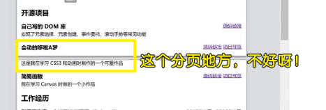

### ✍️ Tangxt ⏳ 2020-11-05 🏷️ resume

# 01-打造自己的专属简历

> 把简历框架搭建好，之后做一个项目就填充一个项目！

## ★本课内容

- 如何找简历模板
- 如何动手制作简历
  - 写内容（HTML）
  - 加功能（JS/echarts）
  - 加样式（CSS）
- 如何生成网页和 PDF
  - 响应式页面
  - print 样式
- 如果你赶时间
  - 直接抄芳芳写好的简历 -> 改成是自己的内容

## ★工具介绍

### <mark>1）简历模板</mark>

> 原则：不要自己设计简历

为什么不要自己设计简历？ -> 因为我们是前端工程师啊，我们只管把页面做出来，不管如何设计页面，毕竟大部分前端的审美都是比较一般的或者亮瞎他人的眼睛

模板选定好后，就开始制作了！ -> 简历模板图片 -> 网页化！

💡：去哪找简历模板？

- Google：「cv template」/「resume template」（可以搜到质量极高的，不过这简历内容是英文的，如果你换成是中文的，那么这简历的整体效果就没那么好看了！）
- 超级简历（内容指导不错，免费用户 / 12 元包月） -> 工作经历可抄它的示例，而项目经历则抄芳芳给出的示例 -> **样式很丑**
- 五百丁（**样式不错**但留白太多，免费模板 / 9.9 模板） -> 不要那些有背景图的简历
- 中文简历模板质量一般都不怎么样 -> 这里说的是白嫖质量，如白嫖五百丁上的免费模板……
- <https://xiedaimala.com> 搜「在线简历」

💡：你为什么认为这个简历模板好看？


### <mark>2）如何制作简历？</mark>

分三步走：

1. 写 HTML
2. 写 JS
3. 写 CSS

## ★写 HTML


💡：`section`标签？

像是小说里的章节 -> 一个`section`就是一章！

出现多个`section`，那么你就可以用一个`article`标签包裹它们！

> 按照自己的理解，`article`是一章，而`section`则是一章里边的一个个相互独立的区块…… -> 为啥就咩有`book`标签呢？

💡：头像？

- 可以用你知乎账号上的头像 -> url
- 本地头像 -> `src/images/avatar.png`

💡：项目的展示图片？

截图比例：`1:1` -> 这是简单的展示图片


> 以前的认知：`4:3` -> 这是项目预览效果的截图

## ★写 JS & 详细内容怎么写

> 为什么先写 JS，而不是 CSS ？ -> 因为 JS 简单，就提前写了 -> 就写一个雷达图就完事儿了！


### <mark>1）Echarts 基本使用</mark>

文档：[5 分钟上手 ECharts](https://echarts.apache.org/zh/tutorial.html#5%20%E5%88%86%E9%92%9F%E4%B8%8A%E6%89%8B%20ECharts)

我需要用到雷达图：[Examples -radar)](https://echarts.apache.org/examples/zh/editor.html?c=radar)

💡：`parcel`这个工具？

我们更改源代码，页面会自动刷新吗？

如果你没有引入 JS，那么你修改 HTML 是不会自动刷新的，反之，你引入了 JS，那么你改 HTML 就会自动刷新！

💡：面试官问你「你觉得自己有什么缺点」？

你的回答可以这样：

我沟通能力不足，为啥要说这个？ -> 因为这个能力比较好提升呀！如主动多问，多沟通就能提升了

很多时候你找不到自己的缺点，那么你就说自己的沟通能力、时间管理能力还不行……

总之，就是一些**很容易说出来怎么提升的能力**！而这种能力是比较好说是自己的缺点的！

💡：面试官问「这个技能点数是怎么算出来的」？

是相对于自己的某项满分值来算的（**自己感到无法提升了，那就是满分值**）！ -> 这可不是跟所有开发者来进行比较的！

说白了，自己设定的标准，自己来给点数！

注意：这雷达图得对应自己的技能介绍……如「完美还原设计稿」意味着技能点数为 100

---

雷达图写好后，JS 也就搞定了 -> 自己打印一下看看有哪些细节需要完善 -> 接下来就写 CSS 了

### <mark>2）详细内容怎么写</mark>

1、工作经历


> 数字给人一种很明确的感觉，就像是以前的考试分数一样（满分 100），你写了 90%，意味着你考了 90 分，让人觉得还不错的感觉！如果你没写这样的数字，那么面试官就只能猜测，或者直接简略看一下就跳过了！

💡：关于「等」？

如果有三个，也只有三个，那么就可以加个「等」结尾

如果超过三个，那就以「等等」结尾了，表示还有很多个、还有其它的！

如：

- 表示列举未尽：我们学习数学、语文等课程
- 列举后煞尾：我喜欢吃橘子、桃子、李子等三种水果

> 煞尾：读音为 shā wěi，汉语词语，意思是**结束事情的最后一段**；收尾。许幸之《忆聂耳》：“由于增加了迭句，最后三个‘前进’，以铿锵有力的休止符来煞尾。”如：事情不多了，马上就可以煞尾。

关于「等等」：

助词，用在两个或两个以上并列的词语后表示**列举未尽**，如：「柴、米、油、盐 等等生活必需品」

💡：还在公司工作时的简历？

那就是「2015 年 1 月 ~ 至今」

2、项目经历

项目 1：


这就是一个**又简洁又有料**的项目描述了！ -> **总 -> 分、成绩 -> 再总结**

项目 2：


项目 3：


3、开源项目

什么样的项目可以放到这个`section`里边去？

代码量少，就 100 多行，无法放到「项目经历」里边，那么就可以把它放进去！

这个`section`的亮点在于「开源」二字 -> 表面自己参与了 Github 的开源运动 -> **有弱点，就找一个优点给补上来**！


开源项目强调你**非常好学**，如：

- 你在学 DOM 时，就做了一个 DOM 库
- 你在学 CSS 时，就做了一个皮卡丘
- 你在学 Canvas 时，就做了一个画板
- ……

总之，这一部分的内容，不是强调你的代码有多么多么的牛逼，而是突出你**学习能力强**！

比如说面试官问你「你觉得你有什么优点？」

你回答之：我学习能力强啊！

面试官追问之：你凭啥认为自己学习能力强？

此时你就可以说一下这些「开源项目」了，然后说明一下自己是怎么学习的！

4、其它链接


只写一个「我的博客」，是没啥意思的，你得具体说明你写了多少篇！ -> **言之有物**

同理，只写一个「我的 GitHub」，也是没用的，你再补充一句「过去三个月有 xxx 次提交」，就显得很不一样了！ -> **提交次数的多寡，表明了你是有在练技术的**！

总之，你稍微比其它人多写一点点的东西，那么整体汇聚起来，就比其它人所写的简历要好看很多！

5、技能


## ★写 CSS （建议直接抄）


### <mark>1）pdf 设置</mark>


根据此刻的导出的 pdf 来进行样式的添加！

💡：如何做到开发时有外边距，而打印时就没有外边距呢？

我们在打印的时候，如果不处理`body`默认的 `8px` `margin` 的话，那么打印出来的 pdf 上方就会有空余

而我们在开发时又需要上方又`margin`，所以这`margin`肯定是不能设为`0`

于是，我们就用到了`media="print"`

> 这是一个很细节的处理！不然，有任何`1px`的偏差，都会让这整个简历的质量看起很 low！

接下来，不需要边看打印效果，边写样式了，直接把整个样式写完了，再去看打印效果，然后再修复一些边边角角！

### <mark>2）bio（biography，简介、生平）</mark>

💡：如何把头像放到右边？

用了绝对定位，如果用右浮动的话，很难把图片对齐！


### <mark>3）education</mark>

如果学历不好，建议把「教育经历」放在最后边！ -> 咩有那么个规定，这个`section`就得放前边！

同理，如果「工作经历」很差，那么也放在后边！

总之，反正所有你觉得是差的，都往后边放！

### <mark>4）projects</mark>

> 写样式时，先把选择器都给写了，然后再去写样式！ -> `margin-bottom`的值，8 的倍数！

「源码链接」&「项目预览」 -> 使用 flex，而不是右浮！

💡：`list-style-position:inside`？

文档：[CSS list-style-position property](https://www.w3schools.com/cssref/pr_list-style-position.asp)


💡：`display:flex` vs `display:inline-flex`？

- flex： 将对象作为弹性伸缩盒显示
- inline-flex：将对象作为内联块级弹性伸缩盒显示

二者在父容器咩有设置宽度的情况下，一个是宽度自动填满整个水平屏幕，一个则是儿子加起来有多宽，那么父容器就有多宽！

➹：[display：flex 和 display: inline-flex 区别 - 简书](https://www.jianshu.com/p/4d596708f61b)

💡：高低错落？


就像是这样：


我们想让每一段的高度都看起来差不多！ -> 这是根据上边那个英文简历模板来的！


如果没有项目截图，那就长短不一吧！ -> 整体的呈现效果最好是下楼梯的既视感……

当然，实在无法一行容纳，那么你可以删掉一些不必要的内容！

💡：颜色问题？

上边截图里边的项目描述文字，看起来很废眼！

我们让内容变暗一点 `#666`，对其中一些内容进行高亮（`#f60`，此色号是淘宝专用色，我看官网是`#ff5000`，不过此色号相较于`#f60`更为深沉一点，还是`#f60`好看），而且还得让它突出一点（加`strong`，VS Code 有快捷键，选中文字，`ctrl+shift+p` 搜索 `wrap`，选中「使用缩写与包围」，回车，输入标签）


> 不加粗高亮，面试官是不会看你简历的！ -> 这加粗会增大内容的宽度

关于右侧的空白，可以添加项目的 logo！

### <mark>5）openSource</mark>

💡：蓝胖子图片的处理？

为了加这个图片，是否要改布局呢？ -> 这是写 CSS 最纠结的一个地方！

最后选择不加这个图片了，因为忒麻烦了！

### <mark>6）skills</mark>

左右布局

💡：`:first-child`？

`:first-child`表示在一组兄弟元素中的第一个元素。如`p:first-child {}`

这样写：`xxx > :first-child {}`，相当是 `xxx > *:first-child {}` -> 任何一组子元素的第一个元素！

💡：技能描述？

一个`li`如果占两行，而这第二行只有 1 个字或 2 个字 -> 这是很丑的，你必须删掉些内容，让内容最终在一行之内展示完

当然，如果第二行有很多个字，那么就不用删了！

### <mark>7）jobs</mark>

> jobs 是工作，works 则是作品！

💡：为啥总用子选择器？

因为不想对后代产生影响呀！

## ★制作 pdf

在不该分页的地方分了页



做法：


💡：下划线不能去掉？

如果去掉了，别人就不知道这是可以点击的！

💡：pdf 版的取名？

`姓名-前端开发-2020.pdf`

💡：pdf 阅读器推荐

[Adobe Acrobat Reader DC](https://acrobat.adobe.com/us/en/acrobat/pdf-reader.html)

## ★制作手机版

为什么需要？

你在 Boss 直聘上跟人事聊着，需要你的简历，而这大概率会用手机打开你的简历！

如果你咩有做手机适配，那么你的页面在手机上显示是很丑的！

### <mark>1）如何制作？</mark>

1. 抄移动端淘宝的 `meat:vp`
2. 媒体查询，把`article`标签宽高`cm`单位的值改成是`auto`！
3. 媒体查询，修改一下布局

## ★直接白嫖芳芳的简历模板


### <mark>1）部署到 GitHub Pages</mark>

配置`package.json`：

``` json
{
  "scripts": {
    "serve": "rm -rf .cache dist && parcel src/index.html",
    "build": "rm -rf .cache dist && parcel build src/index.html --public-url ./"
  }
}
```

配置`deploy.sh`（自动化脚本）：

``` bash
#!/usr/bin/env sh

# abort on errors
set -e

# build
yarn build

# navigate into the build output directory
cd dist

# if you are deploying to a custom domain
# echo 'www.example.com' > CNAME

git init
git add -A
git commit -m 'deploy'

# if you are deploying to https://<USERNAME>.github.io
# git push -f git@github.com:<USERNAME>/<USERNAME>.github.io.git master

# if you are deploying to https://<USERNAME>.github.io/<REPO>
git push -f git@github.com:ppambler/cv.git master:gh-pages

cd -
```

当你想要部署你的项目时：

``` bash
sh deploy.sh
```

当你想要启动本地服务时：

``` bash
yarn serve
```

当你想要在手机端测试时：

``` bash
yarn serve

# 直接预览打包后的页面
serve -s dist 
```

> `yarn serve`默认就只有一个`localhost` ip，所以你得搞一个可以在手机上访问的 ip，而`serve -s dist`就是做这件事的！ -> 这两个服务都在运行中，那么你在编辑器修改代码，然后保存，手机端也会同步更新效果！

### <mark>2）后续修改简历</mark>

💡：关于图标？

图标有多大，就设置多大：


之前我设置图标大小，都是往内缩小的，而现在则是有多大就放多大！

## ★了解更多

➹：[關於 @media print 的二三事..](https://kakadodo.github.io/2018/03/13/css-media-print-setting/)