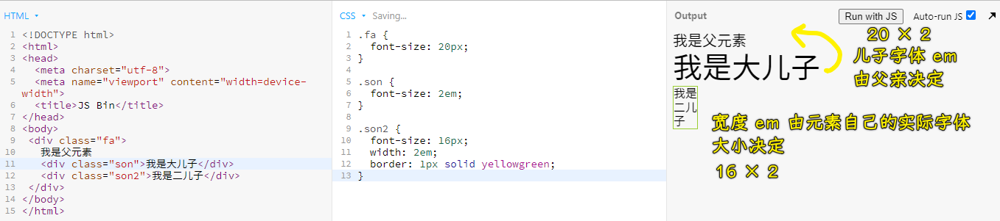
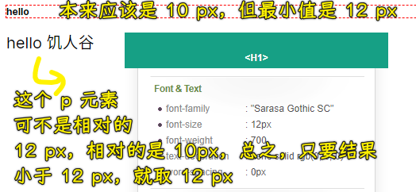
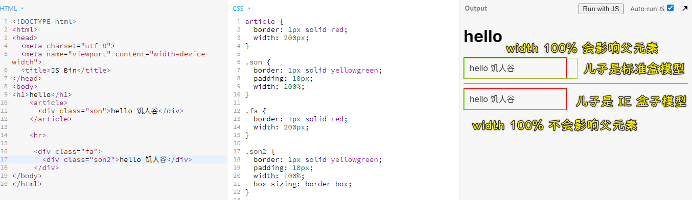

### ✍️ Tangxt ⏳ 2021-04-13 🏷️ CSS 单位

# 01-px、em、rem、vw、百分比的区别

## ★回答

* `px` 是**固定单位**，其它几种都是相对单位。当我们把电脑屏幕的分辨率调为 `1440*900` 时，css 里设置的 `1px` 实际的物理尺寸就是屏幕宽度的 `1/1440`。
* `em`：默认字体大小的倍数。比如给元素设置 `font-size: 2em`，这里的默认字体大小实际上是继承自父亲的大小，`font-size: 2em` 表示当前元素字体大小是父亲的 2 倍。当给元素设置 `width: 2em`，这里的默认字体大小是该元素自身的实际字体大小。
*  `rem`：根元素 (html 节点）字体大小的倍数。比如一个元素设置 `width: 2rem` 表示该元素宽度为 html 节点的 font-size 大小的 2 倍。 如果 html 未设置 font-size 的大小，默认是 16px。
* `1vw` 代表浏览器视口宽度的 `1%`。
* `1%` 对不同属性有不同的含义。 `font-size: 200% `和 `font-size: 2em` 一样，表示字体大小是默认（继承自父亲）字体大小的 2 倍。 `line-height: 200%` 表示行高是自己字体大小的 2 倍。 `width: 100%`表示自己 `content` 的宽度等于父亲 `content` 宽度的 1 倍。

需要注意的是 chrome 浏览器下文字最小是 `12px` ，设置低于 `12px` 的值最终也会展示 `12px` 。

测试 `em` ：



## ★解析

做完下面几个题目，测一测自己是否真正分辨这几个单位的区别

**题目 1**：关于 px，以下说法正确的是？（单选）

* A、小明电脑的分辨率是 1280x800，在写页面 CSS 时给元素设置 width: 1280px。这个元素的实际占据的宽度和电脑屏幕宽度相同
* B、小明电脑的分辨率是 1280x800，在写页面 CSS 时给元素设置 width: 1280px。这个元素的实际占据的宽度和浏览器窗口宽度相同
* C、小明把电脑的分辨率调到 2560x1600，CSS 里元素宽度依旧是 width: 1280px。这个元素的实际占据的宽度和电脑屏幕宽度相同
* D、小明把电脑的分辨率调到 2560x1600，CSS 里元素宽度依旧是 width: 1280px。这个元素的实际占据的宽度和浏览器窗口宽度相同

**题目 2:** 下面代码中，body、article、p 的实际字体大小分别是多少？

``` html
<!DOCTYPE html>
<html>

<head>
  <meta charset="UTF-8">
  <title>em 演示</title>
</head>

<body>
  <article>
    <p>hello 饥人谷</p>
  </article>

  <style>
    body {
      font-size: 2em;
    }

    p {
      font-size: 2em;
    }
  </style>
</body>

</html>
```

* A、body 是 32px， article 是 16px，p 是 32px
* B、body 是 32px， article 是 32px，p 是 64px
* C、body 是 16px， article 是 16px，p 是 32px
* D、body 是 32px， article 是 32px，p 是 32px

**题目 3**: 以下代码中，p 的 width 的实际值是多少？（单选）

``` html
<!DOCTYPE html>
<html>

<head>
  <meta charset="UTF-8">
  <title>em 演示</title>
</head>

<body>
  <article>
    <p>hello 饥人谷</p>
  </article>

  <style>
    body {
      font-size: 2em;
    }

    p {
      font-size: 2em;
      width: 2em;
    }
  </style>
</body>

</html>
```

* A、32px
* B、64px
* C、128px
* D、256px

**题目 4**: 以下代码中，p 的字号是多少？（单选）

* A、20px
* B、40px
* C、80px
* D、32px

``` html
<!DOCTYPE html>
<html>

<head>
  <meta charset="UTF-8">
  <title>rem 演示</title>
</head>

<body>
  <article>
    <p>hello 饥人谷</p>
  </article>

  <style>
    body {
      font-size: 10px;
    }

    article {
      font-size: 20px;
    }

    p {
      font-size: 2rem;
    }
  </style>
</body>

</html>
```

**题目 5**：Chrome 下以下代码，h1 和 p 的字号分别是？（单选）

* A、h1 12px, p 20px
* B、h1 10px, p 20px
* C、h1 16px, p 32px
* D、h1 18px, p 36px

``` html
<!DOCTYPE html>
<html>

<head>
  <meta charset="UTF-8">
  <title>rem 演示</title>
</head>

<body>
  <h1>hello</h1>
  <article>
    <p>hello 饥人谷</p>
  </article>

  <style>
    html {
      font-size: 10px;
    }

    body {
      font-size: 18px;
    }

    h1 {
      font-size: 1rem;
    }

    article {
      font-size: 20px;
    }

    p {
      font-size: 2rem;
    }
  </style>
</body>

</html>
```

**题目 6**：关于 vw，以下说法正确的是（单选）

* A、小明电脑的分辨率是 1280x800，在写页面 CSS 时给元素设置 width: 100vw，表示这个元素的 width 宽度和电脑屏幕宽度相同，是 1280px
* B、小明电脑的分辨率是 1280x800，在写页面 CSS 时给元素设置 width: 100vw，表示这个元素的 width 和浏览器的窗口宽度相同
* C、小明电脑的分辨率是 1280x800，在写页面 CSS 时给元素设置 width: 100vw，表示这个元素的 width 和父容器的 width 相同
* D、width: 100vh 和 width: 100% 等价

**题目 7**：关于 width: 100%，以下说法正确的是（多选）

* A、在标准盒模型下，width: 100%表示元素的 content 宽度等于父元素的 content 宽度
* B、在标准盒模型下，width: 100%表示元素的 content 宽度等于父元素的 content + padding + border 宽度
* C、IE 盒模型下，width: 100%表示元素的 content + padding + border 宽度等于父元素 content 的宽度
* D、IE 盒模型下，width: 100%表示元素的 content 宽度等于父元素 content 的宽度

----

我的答案：A、B、C、D、B、B、AC

错了第五题：



关于第七题：

- 不管是何种盒子模型，子元素的宽度`100%`相对的都是父元素的`content`宽度
- 子元素到所占的领地到底有多宽，取决于子元素是何种盒子模型……
  - 标准盒模型 -> 领地大点，会影响父元素
  - IE 盒模型 -> 领地小点，不会影响父元素



## ★答案解析

题目 1：A 。

题目 2：B。html 默认是 16px，body 是 2em，是默认的 2 倍 32px， article 是 32px，p 是 article 的 2 倍 64px。

题目 3：C。p 的宽度是默认字号的 2 倍， 字号是 64px。

题目 4：D。p 是 2rem，是 html 字号的 2 倍。 html 默认字号是 16px。

题目 5：A。 h1 字号是 1rem，是 html 字号的 1 倍 10px。但 Chrome 下字号最小值是 12px，所以 h1 是 12px。p 是 2rem，即 html 字号的 2 倍 20px。

题目 6：B。100vw 表示把浏览器窗口宽度分 100 份，占 100 份。 注意浏览器窗口宽度和屏幕宽度的区别。

题目 7：A、C。在标准盒模型下，width: 100%表示元素的 content 宽度等于父元素的 content 宽度，IE 盒模型下，width: 100%表示元素的 content + padding + border 宽度等于父元素 content 的宽度。动手做个测试即可。
